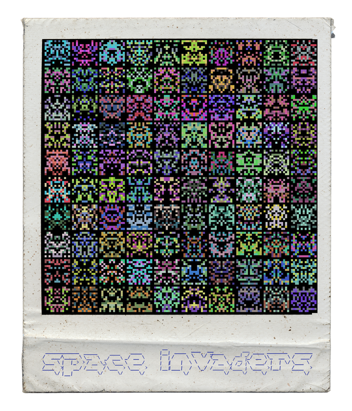

polaroidme - vintage polaroid style + generative art
====================================================

what
----

polaroidme is a simple command-line-tool & python-library for placing an image
into a Polaroid-like frame and optionally put a title / description or meta infos
out of EXIF-data on the bottom. The default font mimics scribbled handwriting
but any (ttf-)font which suits your taste is supported. The tool offers basic
features like auto-scaling up-/downwards and/or cropping, using any (ttf-)font,
supports high-res output and gets it's job done well.

</img>

Starting as [a script for making high-res contactsheets which make the beholder's eyes not bleed](https://github.com/s3h10r/imaco) recently polaroidme gets phonky by providing:

* generative-art-"generators" which are fun to play with
* chainable filters (`--filter f1,f2,...,fN`)
* reading EXIF-data
* lightweight plugin-framework - makes it simple to use (and write) additional filters & generators
* support for templates
* `--help`-option :)

To see if it fits your needs take a look at the project's github-repo and check out the
[examples](https://github.com/s3h10r/polaroidme/blob/master/README.md)

Example output (with templates):

</img>
</img>

The basic usage is a no-brainer (and produces relatively boring results):

```console
foo@bar:~$ polaroidme ./example/example.png .jpg --title "thatseasyhu?" -o /tmp/mypolaroid.png
```

To get an appealing rugged analogue style you can also make "huge" prints of [use high-resolution scans of polaroid Frames - the ones i use at the moment can be downloaded here for free](http://www.fuzzimo.com/free-hi-res-blank-polaroid-frames/).

Sadly i don't know a source of CreativeCommons (or alike) licensed scans in that
high quality and i don't own a good scanner - if you would like to help:
adding some high-res scans in the FLOSS tradition - means for "free as in freedom, not as in beer" - would be wonderfull! (:

why
---
My main usecase for polaroidme is doing minimalistic artworks in
printing quality with it - and learning and mixing fun to use technologies
full-stack around it (raspi, webapis, flutter). :-)

</img>
</img>
<!--
pom --generator squares+circles -o /tmp/test.jpg --filter ascii --title '3xp70!t __init__.py' --template /home/s3h10r/development/polaroidme/polaroidme/templates/random --max-size 600 && feh /tmp/test.jpg
-->
</img>
</img>

Contributions are welcome, and they are greatly appreciated!

Please feel free to
send pull-requests and use the [issue tracker](https://github.com/s3h10r/polaroidme/issues).

installation
------------

To install polaroidme, run this command in your terminal:

```console
    $ pip install polaroidme
```

This is the preferred method to install the software, as it will always install
the most recent stable release.

If you don't have [pip](https://pip.pypa.io) installed, this [Python installation guide](http://docs.python-guide.org/en/latest/starting/installation/) can guide
you through the process.

usage
-----

simple usecase:

```console
foo@bar:~$ polaroidme ./example/example.png -o /tmp/mypolaroid.png
```

If the `-o, --output` argument is omitted the resulting filename will be the input-filename
extended by the string '.polaroid.' For example:

```console
foo@bar:~$ polaroidme ./example/example.png --size 400 --nocrop --title "--nocrop option"
```

will create the file `./example/example.polaroid.png`.

To display the creation date of the Photo (EXIF-data) as title the
option `-title-meta` can be used:

```console
foo@bar:~$ polaroidme ./example/example.png -o ./example/example.polaroid.png --size 400 --title-meta
```

To view the picture from the console you can use [feh](https://feh.finalrewind.org)
or any image viewer of your choice:

```console
foo@bar:~$ feh ./example/example.polaroid.png
```

Use `polaroidme --help` and/or the sourcecode to get a description of all available options - it
gets more inspiring:

```console
foo@bar:~$ polaroidme --help

polaroidme - converts an image into vintage polaroid style

Usage:
  polaroidme <source-image> [--output=<filename>]
  polaroidme <source-image> [-o=<filename>] [--title=<str>] [--title-meta] [--font=<f>] [--filter=<str>]
  polaroidme <source-image> [-o=<fn>] [--template=<str>] [--config=<str>] [--crop] [--alignment=<str>] [--filter=<str>] [--title=<str>]
  polaroidme <source-image> [-o=<fn>] [--nocrop|--crop] [--alignment=<str>] [--size-inner=<n>] [--max-size=<w>] [--template=<str>] [--config=<str>] [--title=<str>][--title-meta] [--filter=<str>]
  polaroidme <source-image> [-o=<fn>] [--template=<str>] [--config=<str>] [--title=<str>][--title-meta] [--font=<f>] [--size-inner=<n>] [--max-size=<w>] [--filter=<str>]
  polaroidme <source-image> [-o=<fn>] [--size-inner=<n>] [--alignment=<str>] [--title=<str>][--title-meta] [-f=<f>] [--template=<str>] [-c=<str>] [-m=<w>] [--filter=<str>]
  polaroidme <source-image> [--nocrop|--crop] [--alignment=<str>] [--title=<str>] [--title-meta] [-f=<str>] [-s=<n>] [-o=<filename>] [--template=<str>] [--config=<str>] [--max-size=<w>] [--filter=<str>]
  polaroidme <source-image> [--clockwise|--anticlock] [--nocrop|--crop] [--title=<str>] [--title-meta] [-f=<f>] [-s=<n>] [-o=<fn>] [--alignment=<str>] [--template=<str>] [-config=<str>] [-m=<w>] [--title-meta] [--filter=<str>]
  polaroidme [--generator=<str>] [-o=<fn>] [--template=<str>] [-config=<str>] [--filter=<str>] [--clockwise|--anticlock] [--title=<str>] [--title-meta] [-f=<f>] [-s=<n>] [-m=<w>]

Where:
  source-image    Name of the image file to convert.
Options:
  --alignment=<str> Used for cropping - specifies the portion of the image
                    to include in the final output.
                    One of 'top', 'left', 'bottom', 'right' or 'center'.
                    'top' and 'left' are synonomous as are 'bottom' and
                    'right'. (default="center").
                    Not of any use if --nocrop option is set.
  --anticlockwise   Rotate the image anti-clockwise before processing
  -c,--config=<py>  a config is only necessary if --template is used (see docs)
  --clockwise       Rotate the image clockwise before processing
  --crop            the images will be cropped to fit. see --alignment
  -f, --font=<f>    Specify (ttf-)font to use (full path!)
  --filter=<str>    One or more (seperated by comma) of
                    'ascii', 'ascii-color', 'pixelsort', 'diffuse', 'emboss',
                    'find_edge', 'glowing_edge', 'ice', 'molten', 'mosaic', ...
                    If more than one filter is used (filterchain) they will be applied in
                    the sequence given.
  --generator=<str> Get phonky & create some generative art instead of using an input-image.
  -s,--size-inner=<n> Size of the picture-part of the polaroid in pixels (default=800)
  -t,--title=<str>  Defines an optional caption to be displayed at the
                    bottom of the image. (default=None)
  --title-meta      Adds EXIF-data (date of capturing) to the title. If Input is
                    a generator this adds infos about the generator's params.
  -m,--max-size=<w> Sets maximum size (width) of the created polaroid.
                    (size-inner + frame <= max-size)
  --nocrop          Rescale the image to fit fullframe in the final output
                    (default="--crop"). btw. alignment is ignored if option is set.
  -o, --output=<s>  Defines the name of the outputfile. If omitted a filename
                    based on the original will be used - example:
                    'test.polaroid.png' will be used as filename if input-file is 'test.png'
  --template=<t>    Specify a template to use. A template can be a high-res
                    scan of a real Polaroid or something of its shape.
                    By using a template the visual output quality gains on
                    expression & authenticity.

  -h, --help        Print this.
      --version     Print version.

The `latest version is available on github: https://github.com/s3h10r/polaroidme>
```

installation from sources
-------------------------

The sources for polaroidme can be downloaded from the [Github repo](https://github.com/s3h10r/polaroidme).

You can clone the public repository:

```console
    $ git clone https://github.com/s3h10r/polaroidme
```

Once you have a copy of the source, you can install it with:

```
    $ python setup.py install
```


<!--
Instead of installing the software system-wide it's usally best practice to install
it in a python-virtualenv:

```console
foo@bar:~$ python3 -m venv vent_polaroidme
foo@bar:~$ source venv_polaroidme/bin/activate
(venv_polaroidme) foo@bar:~$ pip install polaroidme
[...]
Installing collected packages: polaroidme
  Running setup.py install for polaroidme ... done
Successfully installed polaroidme-0.8.6
(venv_polaroidme) foo@bar:~$ polaroidme
(venv_polaroidme) foo@bar:~$ ...
(venv_polaroidme) foo@bar:~$ deactivate
foo@bar:~$
```
-->
Does it integrate into other apps?
----------------------------------

Though polaroidme is intended and commonly used as a hackish command-line-tool it is also
a regular python-module (since version 0.9.2). Using it in other apps is
therefore as simple as:

```
#!/usr/bin/env python3

from polaroidme import make_polaroid
from.polaroidme.plugins.filters import ascii

[...]
```

Credits
-------

The ASCII-art filter relies on codesnippets from the following Open Source projects:

 - [asciify](https://github.com/RameshAditya/asciify)
 - [ImageToAscii](https://github.com/cleardusk/ImageToAscii/blob/master/img_to_ascii.py)
   Copyright (c) 2018 Jianzhu Guo, MIT License

The generator 'sprites' is made with [code by Eric Davidson](https://medium.freecodecamp.org/how-to-create-generative-art-in-less-than-100-lines-of-code-d37f379859f).

The generator 'psychedelic' is the wonderfull code of ["Random (Psychedelic) Art, and a Pinch of Python" by Jeremy Kun](http://jeremykun.com/2012/01/01/random-psychedelic-art/).

The generator 'circles' is heavily [inspired by Kevin Howbrook's Squares|https://medium.com/@kevinhowbrook/learning-python-and-being-creative-making-art-with-code-da02880e3738]

Some filters are taken from:

 - [https://github.com/Tinker-S/SomeImageFilterWithPython](https://github.com/Tinker-S/SomeImageFilterWithPython)

**Thank you guys!** Live long and prosper!

All the crap and bugs in the code is made by me of course. Please feel free to refacture, fix, tinker, ...

 changelog
 ---------

* please see [CHANGELOG.md](./CHANGELOG.md)

License
-------

polaroidme is made with <3, actively maintained & developed by Sven Hessenmüller.

MIT License

Copyright (c) 2019 Sven Hessenmüller <sven.hessenmueller@gmail.com>

Permission is hereby granted, free of charge, to any person obtaining a copy
of this software and associated documentation files (the "Software"), to deal
in the Software without restriction, including without limitation the rights
to use, copy, modify, merge, publish, distribute, sublicense, and/or sell
copies of the Software, and to permit persons to whom the Software is
furnished to do so, subject to the following conditions:

The above copyright notice and this permission notice shall be included in all
copies or substantial portions of the Software.

THE SOFTWARE IS PROVIDED "AS IS", WITHOUT WARRANTY OF ANY KIND, EXPRESS OR
IMPLIED, INCLUDING BUT NOT LIMITED TO THE WARRANTIES OF MERCHANTABILITY,
FITNESS FOR A PARTICULAR PURPOSE AND NONINFRINGEMENT. IN NO EVENT SHALL THE
AUTHORS OR COPYRIGHT HOLDERS BE LIABLE FOR ANY CLAIM, DAMAGES OR OTHER
LIABILITY, WHETHER IN AN ACTION OF CONTRACT, TORT OR OTHERWISE, ARISING FROM,
OUT OF OR IN CONNECTION WITH THE SOFTWARE OR THE USE OR OTHER DEALINGS IN THE
SOFTWARE.
