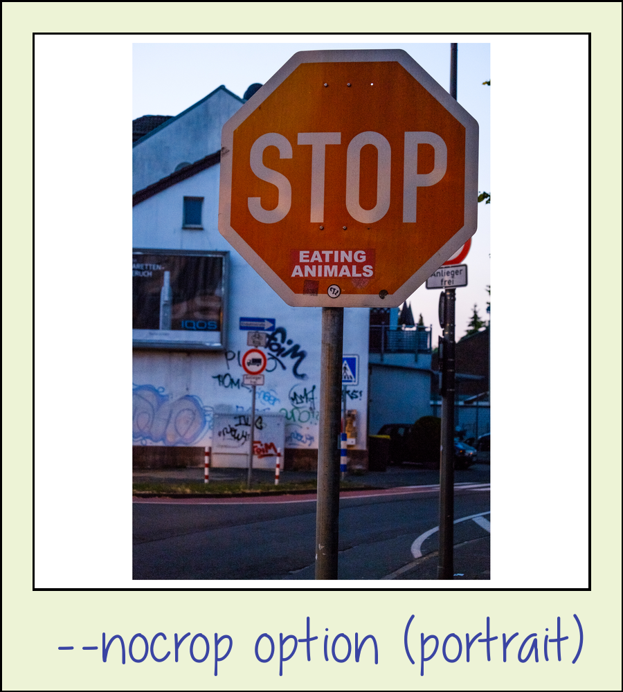

polaroidme - converts an image into vintage polaroid style
==========================================================

polaroidme is a command-line-tool for placing an image into a
Polaroid-like frame and optionally put a title / description on the bottom.
The default font mimics scribbled handwriting but any (ttf-)font
which suits your taste is supported. The tool offers basic features
like auto-scaling up-/downwards and/or cropping, using any (ttf-)font,
supports high-res output and gets it's job done well.

polaroidme is simple to use:

```console
foo@bar:~$ polaroidme ./example/example.png .jpg --title "thatseasyhu?" -o /tmp/mypolaroid.png
```

Example output:

</img>
</img>


If you need more control over the output polaroidme offers you plenty of options.
The `--nocrop` Flag is an example of an option which is handy if your input images
are not in square-format and you don't want to get parts cropped (default).   


Though polaroidme is intended and commonly used as a command-line-tool it is also
a regular python-module (since version 0.9.2). Using it in other software is
therefore as simple as:

```
#!/usr/bin/env python3

from polaroidme import make_polaroid

[...]
```

polaroidme is actively maintained & developed (2019). To see if it fits
your needs take a look at the project's github-repo and check out the
[examples](https://github.com/s3h10r/polaroidme/blob/master/README.md)

Contributions are welcome, and they are greatly appreciated!

installation
------------

To install polaroidme, run this command in your terminal:

```console
    $ pip install polaroidme
```

This is the preferred method to install polaroidme, as it will always install
the most recent stable release.

If you don't have [pip](https://pip.pypa.io) installed, this [Python installation guide](http://docs.python-guide.org/en/latest/starting/installation/) can guide
you through the process.

more example output
-------------------

</img>
</img>
</img>
</img>

<!-- TODO: add contactsheet example -->

usage
-----

example usage:

```console
foo@bar:~$ polaroidme ./example/example.png .jpg -o /tmp/mypolaroid.png
```

If the `-o, --output` argument is omitted the resulting filename will be the input-filename
extended by the string '.polaroid.' For example:

```console
foo@bar:~$ polaroidme ./example/example.png --size 400 --nocrop --title "--nocrop option"
```

will create the file `./example/example.polaroid.png`.

To view the picture from the console you can use [feh](https://feh.finalrewind.org)
or any image viewer of your choice:

```
foo@bar:~$ feh ./example/example.polaroid.png
```

Use `polaroidme --help` to get a description of all available options:

```
polaroidme - converts an image into vintage polaroid style

Usage:
  polaroidme <source-image> [--output=<filename>] [--title=<str>]
  polaroidme <source-image> [--title=<str>] [--font=<f>] [--output=<filename>]
  polaroidme <source-image> [--size=<n>] [--alignment=<str>] [--title=<str>] [--output=<filename>] [--font=<f>]
  polaroidme <source-image> [--nocrop|--crop] [--title=<str>] [--font=<str>] [--size=<n>] [--output=<filename>] [--alignment=<str>]
  polaroidme <source-image> [--clockwise|--anticlock] [--nocrop|--crop] [--title=<str>] [--font=<f>] [--size=<n>] [--output=<filename>] [--alignment=<str>]


Where:
  source-image    Name of the image file to convert.
  size            Size of the picture-part of the polaroid in pixels (default=800)
  alignment       Used for cropping - specifies the portion of the image
                  to include in the final output.
                  One of 'top', 'left', 'bottom', 'right' or 'center'.
                  'top' and 'left' are synonomous as are 'bottom' and
                  'right'. (default="center").
                  Not of any use if --nocrop option is set.
  title           Defines an optional caption to be displayed at the
                  bottom of the image. (default=None)
  font            Specify (ttf-)font to use (full path!)

Options:
  --nocrop         Rescale the image to fit fullframe in the final output
                   (default="--crop"). btw. alignment is ignored if option is set.
  -o, --output=<s> Defines the name of the outputfile. If omitted a filename
                   based on the original will be used - example:
                   'test.polaroid.png' will be used as filename if input-file is 'test.png'
  -f, --font=<f>   Specify (ttf-)font to use (full path!)
  -s, --size=<s>   Specifiy width of thumbnail in pixels (default=200)
  --clockwise      Rotate the image clockwise before processing
  --anticlockwise  Rotate the image anti-clockwise before processing

  -h, --help       Print this.
      --version    Print version.
```

installation from sources
-------------------------

The sources for polaroidme can be downloaded from the [Github repo](https://github.com/s3h10r/polaroidme).

You can clone the public repository:

```console
    $ git clone https://github.com/s3h10r/polaroidme
```

Once you have a copy of the source, you can install it with:

```
    $ python setup.py install
```


<!--
Instead of installing the software system-wide it's usally best practice to install
it in a python-virtualenv:

```console
foo@bar:~$ python3 -m venv vent_polaroidme
foo@bar:~$ source venv_polaroidme/bin/activate
(venv_polaroidme) foo@bar:~$ pip install polaroidme
[...]
Installing collected packages: polaroidme
  Running setup.py install for polaroidme ... done
Successfully installed polaroidme-0.8.6
(venv_polaroidme) foo@bar:~$ polaroidme
(venv_polaroidme) foo@bar:~$ ...
(venv_polaroidme) foo@bar:~$ deactivate
foo@bar:~$
```
-->

TODO
----

 - custom colors
 - finish contactsheet (feature-branch) and add it to master
 - basic automated testing
 - rewrite corkboard (lab-branch) and add to master
 - option to put a description-text below title
 - eye-candy like distortion filters / blending paper textures


 changelog
 ---------

 **0.9.2**
 - implements convinient argparsing (via docopt)
 - minor bugfixes
 - makes code also usable as a python-module and export `make_polaroid()`-function
 - inits contactsheet-script (thumbnails can be polaroids with filename as caption)
 - testbuild-script
 - updates docs

 **0.9.1**
 - argument alignment omitted if `--nocrop option` is set
 - updates packaging meta-data & docs
 - adds more free fonts. changes default font to [Jakes Handwriting](https://www.dafont.com/jakeshandwriting.font)

 **0.9.0**
 - packaging (pypi)

 **0.8.4**
 - updates usage-string
 - adds correct file encoding (`pydoc3 ./polaroidme`)

 **0.8.2**
 - adds free example fonts (source: https://www.dafont.com/ttf.d592)
 - support for different fonts via argument

 **0.8.0**
 - supports for high-res output (argument size, default=800)
 - adds `--nocrop` option
 - refactoring

 **0.1.0**

 - initial commit based on https://github.com/thegaragelab/pythonutils/tree/master/polaroid
 - converts to python3
